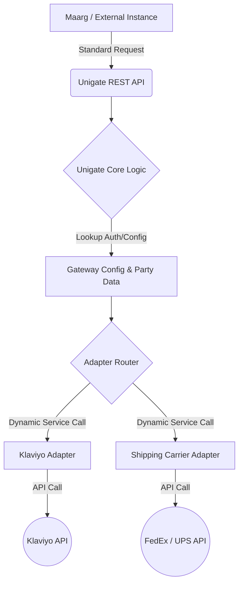

# Unigate: Internal user manual and onboarding guide

Unigate is a centralized gateway used by HotWax Commerce to manage all email and shipping integrations in one place. Instead of setting up Klaviyo or FedEx inside every single application, we set it up once in Unigate, and other systems (like Maarg) simply "talk" to Unigate.

This manual explains how to onboard a new brand onto Unigate, generate security keys, and link them to Maarg.

---

## 1. System overview

Unigate works like a universal adapter:
1. **The Brand (Tenant)**: The specific client we are setting up (e.g., ADOC, Merrell).
2. **The Gateway**: The service we are connecting to (e.g., Klaviyo for emails).
3. **The Connection (API Key)**: How Unigate and Maarg securely talk to each other.

### System architecture



---

## 2. How Unigate works

Think of Unigate as a universal translator and orchestration hub. It sits between your core logic (Maarg) and the outside world (Klaviyo, FedEx).

### A. The problem: Integration sprawl
In the traditional model, every application has to be individually "taught" how to talk to every external provider. If you have five applications (brand-specific instances) and three providers (Klaviyo, FedEx, UPS), you end up with 15 complex, hard-to-maintain connections.

### B. The Unigate solution: One connection, many adapters
Unigate simplifies this into a centralized link. Maarg speaks a "Standard Language" to Unigate, and Unigate translates that into the specific dialect of the provider.

#### 1. The request lifecycle
When a request is made, it follows this automated path:
1.  **Incoming Request**: Maarg sends a standard JSON payload (e.g., "Ready for Pickup") to the Unigate REST API.
2.  **Authentication & Tenant Check**: Unigate verifies the API Key and checks the `CommGatewayAuth` record to verify this specific brand (e.g., ADOC) has permission to use the gateway.
3.  **The Adapter Router**: Unigate looks up its configuration. It identifies which Adapter Service (e.g., `KlaviyoServices.send#Email`) is responsible for this gateway.
4.  **Transformation**: The Adapter takes the generic HotWax data and runs it through a Template (like `SendEmailTemplate.ftl`) to format it exactly how the provider requires.
5.  **External Handshake**: Unigate makes the final encrypted API call to the provider (Klaviyo/FedEx) and captures the response.
6.  **Response Feedback**: Unigate translates the provider's technical response (success or error) back into a simple status for Maarg.

#### 2. Configuration-driven approach
Unigate is built so that adding a new brand often requires zero new code.
- Onboarding a new brand is as simple as adding a few XML records (Party, UserAccount, and CommGatewayAuth). The software "discovers" these new records and immediately knows how to handle the brand's data.

#### 3. Security and multi-tenancy
Even though Unigate is a shared system, it is strictly partitioned:
- **Tenant Isolation**: Brand A's configurations and API keys are completely invisible to Brand B. They share the "engine" but have separate "fuel tanks" (data).
- **Credential Masking**: External API secrets (like Klaviyo Private Keys) are stored securely inside Unigate. Maarg users never handle or even see these sensitive secrets.


## 3. Step-by-step brand onboarding

To set up a new brand, you need to load a specific set of data into the Unigate instance.

### Step 1: Create the brand identity
First, we tell Unigate that a new brand exists. Change the `partyId` and `organizationName` to match the brand.

```xml
<co.hotwax.unigate.Party partyId="BRAND_NAME" partyTypeEnumId="PtyOrganization">
    <organization organizationName="BRAND_DESCRIPTION" />
</co.hotwax.unigate.Party>
```

### Step 2: Create the security account
Every brand needs an "API User" account in Unigate. This is what Maarg will use to log in.

```xml
<moqui.security.UserAccount 
    userId="BRAND_NAME" 
    username="brand.apiuser" 
    userFullName="Brand Integration User" 
    partyId="BRAND_NAME" 
/>

<!-- Add to the Unigate API group so it has permission to send data -->
<moqui.security.UserGroupMember 
    userGroupId="UNIGATE_API" 
    userId="BRAND_NAME" 
    fromDate="2024-01-01T00:00:00" 
/>
```

### Step 3: Configure gateway access
Tell Unigate where to send the data (e.g., the Klaviyo URL) and how to authenticate with that provider.

```xml
<moqui.service.message.SystemMessageRemote 
    systemMessageRemoteId="REMOTE_CONFIG_ID" 
    description="Klaviyo API for Brand" 
    sendUrl="https://a.klaviyo.com/api/" 
    authHeaderName="Authorization" 
/>
```

### Step 4: Activate the integration
Link the Brand (Step 1) to the Gateway (Klaviyo) and the Remote Config (Step 3).

```xml
<co.hotwax.unigate.CommGatewayAuth 
    systemMessageRemoteId="REMOTE_CONFIG_ID" 
    commGatewayConfigId="KLAVIYO" 
    tenantPartyId="BRAND_NAME"
    fromDate="2024-01-01 00:00:00.000" 
/>
```

---

## 4. Security: Generating the Unigate API key

Maarg needs a special "Login Key" to talk to Unigate securely. Do not use the account password.

### How to generate the key:
1.  **Log in**: access the Unigate Moqui instance using your credentials.
2.  **Select Application**: on the `Choose an Application` screen, click on the `Unigate` card.
3.  **Find the Tenant**: you will land on the page where all the tenants are listed. Find and click on the `Tenant` you created in Step 1.
4.  **Generate Key**: you will land on the `Tenant Details` page. Click the `Create UserLoginKey` button.
5.  **Save the Key**: once the key is generated, copy and save it immediately. It is required for the Maarg configuration in the next section.

---

## 5. Connecting Maarg to Unigate

Now, you must go to the **Maarg Instance** and tell it how to reach Unigate using the key you just generated.

### Setting up the remote connection in Maarg
Add this data to the Maarg instance. 

> [!IMPORTANT]
> - Replace `INSERT_GENERATED_KEY_HERE` with the key you generated in Section 4.
> - `remoteId` MUST be the Unigate Gateway ID (e.g., `KLAVIYO`).
> - `internalId` MUST be the Unigate Tenant ID (e.g., `BRAND_NAME`).

```xml
<moqui.service.message.SystemMessageRemote 
    systemMessageRemoteId="UNIGATE_BRAND_NAME" 
    sendUrl="https://unigate.hotwax.io/rest/s1/unigate" 
    remoteId="KLAVIYO" 
    internalId="BRAND_NAME"
    authHeaderName="api-key"
    authHeaderValue="INSERT_GENERATED_KEY_HERE"
/>
```

### Pointing email triggers to Unigate

Finally, tell Maarg which emails should be sent via Unigate.

```xml2
<org.apache.ofbiz.product.store.ProductStoreEmailSetting 
    emailType="READY_FOR_PICKUP" 
    productStoreId="STORE_ID" 
    systemMessageRemoteId="UNIGATE_BRAND_NAME"
/>
```

---

## 6. Understanding data payloads

To verify setups are correct, you must understand what data Unigate actually sends to the external services.

### A. Klaviyo data structure
When Maarg triggers an email or event, Unigate transforms the data into the following JSON format for Klaviyo:

| Field | Description | Example |
| :--- | :--- | :--- |
| `metric.name` | The "Event" name in Klaviyo (e.g., Order Placed). | `READY_FOR_PICKUP` |
| `profile.email` | The customer's primary email address. | `customer@example.com` |
| `order_id` | The internal HotWax Order ID. | `10001` |
| `order_number` | The customer-facing Order Number. | `ORD-2024-001` |
| `first_name` | Customer's first name. | `John` |
| `last_name` | Customer's last name. | `Doe` |
| `pickup_location` | Details of the store where the order is being picked up. | `{ "company": "Downtown Store", ... }` |
| `line_items` | List of products, quantities, and prices. | `[{ "name": "Classic T", "price": 20.00 }, ...]` |
| `grand_total` | Final total amount of the order. | `105.50` |

> [!NOTE]
> Unigate also calculates Savings Total (discounts) and Subtotal automatically before sending to Klaviyo.

### B. Shipping data
For shipping integrations, Unigate handles the exchange with carriers.

1.  **Rates**: Unigate sends the package dimensions, weight, and delivery address to the carrier.
2.  **Labels**: once confirmed, Unigate requests the label. The carrier sends back an `encodedLabel` (a long string), which Unigate converts into a printable PDF or image for Maarg.

---


## 7. Troubleshooting

*   **Maarg cannot connect to Unigate:** check if the `api-key` in Maarg matches the one generated in Unigate. Verify the Unigate URL is accessible from Maarg.
*   **Klaviyo is not receiving events:** check the `SystemMessageRemote` URL in Unigate. Verify the `authHeaderValue` (Klaviyo API Key) is correct.
*   **Permission denied:** verify the brand API user is in the `UNIGATE_API` group in Unigate.
